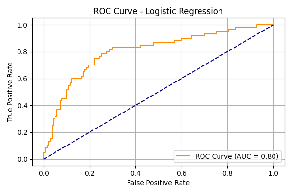

# 🔍 Credit Risk Prediction – CodeAlpha Internship

This project is part of my internship at [@CodeAlpha](https://www.linkedin.com/company/codealpha/) under the **Machine Learning** domain. It aims to build a machine learning model that predicts whether a loan applicant is likely to default (bad credit risk) or not (good credit risk) based on financial and personal attributes.

---

## 📌 Problem Statement

Credit risk assessment is a crucial task in the banking and finance sector. The goal is to classify whether a customer is a **good** or **bad** credit risk based on features like income, loan amount, job type, housing, and more.

---

## 📊 Dataset

- **Source**: UCI German Credit Risk Dataset
- **Target Variable**: `CreditRisk` (0 = Good, 1 = Bad)
- **Total Records**: 1000
- **Features**: Age, Job, Housing, Saving accounts, Credit amount, Duration, Purpose, etc.

---

## 🔧 Technologies Used

- **Python** 🐍
- **Pandas**, **NumPy** for data processing
- **Scikit-learn** for ML modeling
- **Matplotlib**, **Seaborn** for visualization
- **Jupyter Notebook** for development

---

## ⚙️ Installation

Clone the repository and install dependencies:

```bash
git clone https://github.com/KomalLatwal/CodeAlpha_CreditRiskPrediction.git
cd CodeAlpha_CreditRiskPrediction
pip install -r requirements.txt
````

---

## 🚀 How to Run

1. Open the Jupyter notebook:

   ```
   jupyter notebook Credit_Risk_Prediction.ipynb
   ```
2. Run each cell step-by-step.
3. Model will be trained and evaluated automatically.

---

## 🧠 Model Used

* **Logistic Regression** (best performance)
* **Hyperparameter Tuning**: GridSearchCV
* **Scaling**: StandardScaler

---

## 📈 Evaluation Metrics

| Metric                 | Value |
| ---------------------- | ----- |
| Accuracy               | 75%   |
| ROC AUC Score          | 0.80  |
| Average Precision (AP) | 0.64  |
| F1 Score (for class 1) | 0.66  |

---

## 📉 Confusion Matrix (Threshold = 0.5)

```
[[102  38]
 [ 12  48]]
```

---

## 🖼️ Sample Visualizations

* ROC Curve
  

* Precision-Recall Curve
  

---

## 🎯 Final Notes

* Tuned logistic regression model is saved as `logistic_model.pkl`.
* Threshold experimentation showed trade-off between recall and precision.
* Performance is good considering class imbalance and real-world complexity.

---

## 🏁 Project Status

✅ Completed as part of **CodeAlpha Internship**
📅 Duration: May 2025
🎯 Tasks Completed: 1/3

---

## 🔗 Connect With Me

* **LinkedIn**: [Komal Latwal](https://www.linkedin.com/in/KomalLatwal/)
* **GitHub**: [@KomalLatwal](https://github.com/KomalLatwal)

---

## 🏷️ Tags

`#MachineLearning` `#CreditRiskPrediction` `#LogisticRegression` `#CodeAlpha` `#Internship`

```

---


